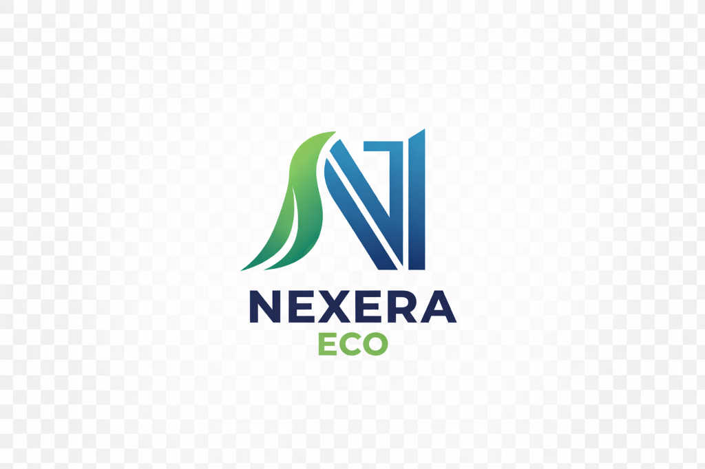

# NexEraEco Website

<div align="center">
  
  <h3>Healing Nature Through IoT</h3>
  <p>Building the next generation of clean energy and agricultural technology.</p>
  
  [](https://nexeraeco.com)
  [](#)
</div>

---

## 🌱 About NexEraEco

NexEraEco is a hardware-focused startup building innovative solutions for clean energy and sustainable agriculture. Our flagship product, **SolarXite**, is a dual-axis solar tracking system designed specifically for rooftop installations.

## 🚀 Products

### SolarXite
- **Status**: TRL-4 Prototype (Lab Validated)
- **Description**: Compact dual-axis solar tracking hardware for rooftops, maximizing energy capture by 25-40%.
- **IP**: Design Patent Registered (India, Patent No: 428970-001)

### Smart Crop Guard
- **Status**: Research Validated
- **Description**: IoT-based animal intrusion detection and precision irrigation system.
- **Publication**: [IEEE Xplore](https://ieeexplore.ieee.org/document/11324174)

---

## 💻 Tech Stack

| Frontend | Styling | Build Tool |
|----------|---------|------------|
| React 18 | Tailwind CSS 4 | Vite |
| React Router | CSS Variables | ESLint |
| Framer Motion | Plus Jakarta Sans | |

---

## 🛠️ Getting Started

### Prerequisites
- Node.js 18+
- npm or yarn

### Installation

```bash
# Clone the repository
git clone https://github.com/praveen0006/NexEraEco-Website.git
cd NexEraEco-Website/react-app

# Install dependencies
npm install

# Start development server
npm run dev
```

The app will be available at `http://localhost:5173`.

### Production Build

```bash
npm run build
npm run preview
```

---

## 🎨 Features

- **Dual Theme System**: Seamless Light/Dark mode with smooth transitions
- **Modern Typography**: Plus Jakarta Sans font family
- **Responsive Design**: Mobile-first, works on all devices
- **Interactive Prototype Gallery**: Detailed hardware showcase
- **Investor Portal**: Dedicated section with funding requirements
- **EPC Partner Portal**: Pilot request forms for solar installers

---

## 📁 Project Structure

```
NexEraEco-Website/
├── react-app/              # Main React application
│   ├── public/assets/      # Images, PDFs, and static files
│   ├── src/
│   │   ├── components/     # Header, Footer, UI components
│   │   ├── pages/          # Route pages (Home, Products, etc.)
│   │   ├── index.css       # Global styles and theme variables
│   │   └── App.jsx         # Main app with routing
│   └── package.json
└── README.md
```

---

## 📧 Contact

- **Email**: praveen19121@gmail.com
- **LinkedIn**: [Praveen Kumar Akula](https://www.linkedin.com/in/praveen-kumar-akula-30a685255/)
- **Phone**: +91 86393 22024

---

## 📄 License

This project is proprietary. All rights reserved by NexEraEco.

---

<div align="center">
  <sub>Built with ❤️ by NexEraEco Team | © 2026</sub>
</div>
